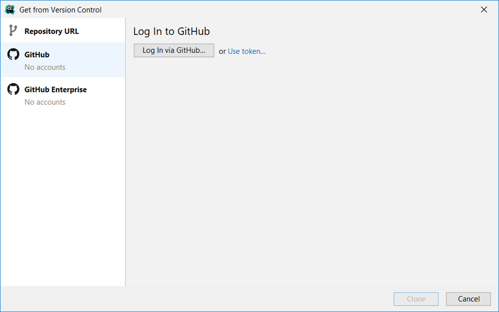

# Before you start

It would be helpful to make sure you have 
a [GitHub account](https://github.com/signup) already created.

You can use either a personal or school email address with your GitHub account.

# CLion

CLion is a **I**ntegrated **D**evelopment **E**nvironment (IDE) created by the 
company JetBrains.  

This is a short guide how to get the free education license for CLion and 
install it on your machine. 

### Educator License
* Start by applying for a license by filling out their application.

    https://www.jetbrains.com/community/education/#students
* After you apply, you will get an email with a confirmation link you will
  need to click.

  

  

### Install and Set up CLion

* Once you have been approved, you can log in using the JB account you created.

    

* When you first open CLion, you should have this welcome window. From here 
you can add your GitHub using **"Get from VCS"**.

* From here, you can add your GitHub credentials:

    

    

    

# Clone Bootcamp Material

Next, you will "clone" the bootcamp material from GitHub to your machine.

### Create a copy of the bootcamp repository

* Navigate to the 
[bootcamp repository](https://github.com/DrErickson/CS301_Bootcamp).

* After that click on **"Use this template" &rarr; "Create a new repository"**

    

* Give your repository a name. 
* Mark your repository public or private based on 
your preference.  Private means other people will not be able to find or 
view your repository.  Public will allow others to find and view your 
repository.
* Click **"Create repository from template"**

    

### Clone material to local machine

* Click "Get from VCS"

  

  Alternatively, you can also click **"File" &rarr; "New" &rarr; "Project from 
  Version Control"**

  
* From here you should be able to see all of your GitHub projects.  Click 
  **Clone**.

  

* Click **"Ok"** after you see the following settings wizard prompt

  

# Configuring the Compiler

Next you will need to configure your compiler.

* [Windows Instructions](2%20-%20Compiler Setup%20(Windows).md)
* [MacOS Instructions](2%20-%20Compiler%20Setup%20(MacOS).md)

# Windows Only (Optional)

There is a small issue with printing where an extra space is printed the 
first instance you call cout.  This can be fixed using the following steps.

### Help &rarr; Find Action

### Search for Registry

### Select run.processess.with.pty

