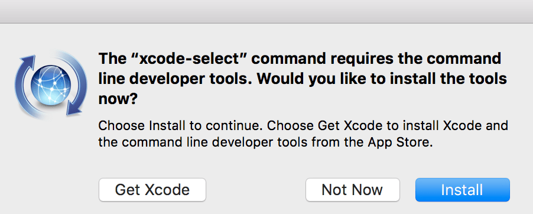
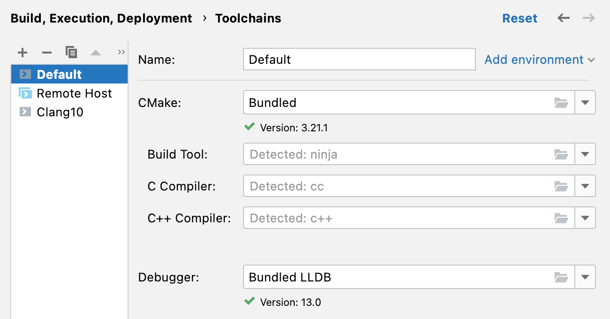

# Compiler Setup MacOS

Click [here](https://www.jetbrains.com/help/clion/quick-tutorial-on-configuring-clion-on-macos.html#reqtools) for more detailed instructions.

## Installing Compiler

The following instructions  will install a C and C++ compiler.

* Open a terminal and run the following command:
    ```
    xcode-select --install
    ```

* Click **"Install"** to proceed with the installation

    

## Verify Compiler Install

CLion should automatically detect the installed compiler.

* Navigate to **"Preferences" &rarr; "Build, Execution, Deployment" &rarr; 
"Toolchains"**

* If the compiler is installed correctly, you should see something similar 
  to the following:




