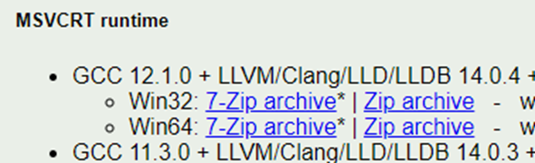
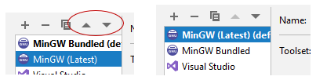

# Compiler Setup (Windows)

There are several different compilers that can be used with CLion.  For the 
bootcamp we recommend the latest version of MinGW.

> **Important Note**
> 
> CLion does come with a version of MinGW pre-installed.  
> However, this version has been known to cause some issues. At the time of 
> writing this guide, we recommend installing the latest version of MinGW 
> using the following steps.

## MinGW

MinGW is a Windows version of g++ and gcc.  We use this compiler as it 
closely matches the compiler linux typically uses.

## Download and Extract the Latest Version of MinGW

* Go to https://winlibs.com/

* Download the latest Zip

  

  

* Unzip the file into a known folder.   I suggest placing it directly into your main C: drive.
After that, you should see the mingw64 folder in your C: drive.

  

## Configure CLion to use MinGW
* Click **"File" &rarr; "Settings"**, 

  

* Click the **"Build, Execution, Deployment" &rarr; "Toolchains"**

    

* Click the **"+"**. You should be able to add the MinGW option.

   

* Under "Toolset", click the folder icon and find the location of your mingw64 
folder.

  

  

* Provide a name for the compiler setting.  Make sure the name is not 
  already used. Here I used "MinGW (Latest)" so it would not conflict with 
  the other versions of MinGW I have installed.

  

* Use the arrows (if needed), to move the MinGW toolchain you created to the 
  top default location.

  

* Make sure you hit "Apply" when you are done.

  