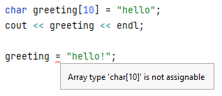
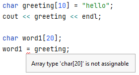
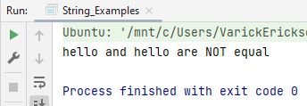
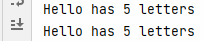
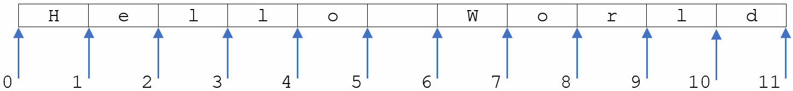
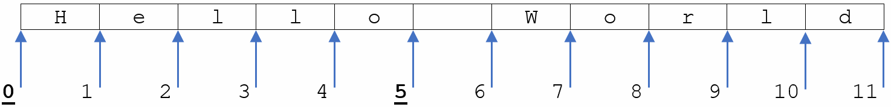
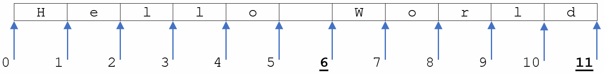
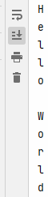

# Strings

## c-strings and C++ strings

> **TLDR**
> 
> If you have a choice between a c-string and a ```std::string```, you
> generally want to use a ```std::string```.
> 
> You should know the difference between a c-string and a ```std:string``` 
> and be familiar with the operations available to ```std:string```.

There are two different ways that strings are represented in C++.

* character array &rarr; c-string
* ```std::string```  &rarr; C++ string object

You will frequently encounter both types of string when programming in C++ 
and you should be aware that while similar, there are some differences in 
their usage.

## c-string

A c-string is an array of characters. To mark the end of the string, the null 
terminal character ```\0``` is used. For example, in the following, we defined 
`greeting` to store the value `hello`.

```c++
char greeting[10] = "hello";    // c-string
```

In memory, the variable `greeting` would store the following information. 
Notice that not all of the spaces are used and that `\0` is used to mark the 
end of the string.

<style type="text/css">
.tg  {border-collapse:collapse;border-spacing:0;}
.tg td{border-color:black;border-style:solid;border-width:1px;font-family:Arial, sans-serif;font-size:14px;
  overflow:hidden;padding:10px 5px;word-break:normal;}
.tg th{border-color:black;border-style:solid;border-width:1px;font-family:Arial, sans-serif;font-size:14px;
  font-weight:normal;overflow:hidden;padding:10px 5px;word-break:normal;}
.tg .tg-8jgo{border-color:#ffffff;text-align:center;vertical-align:top}
.tg .tg-zh46{border-color:inherit;font-family:"Courier New", Courier, monospace !important;text-align:left;vertical-align:top}
</style>
<table class="tg">
<thead>
  <tr>
    <th class="tg-zh46">'h'</th>
    <th class="tg-zh46">'e'</th>
    <th class="tg-zh46">'l'</th>
    <th class="tg-zh46">'l'</th>
    <th class="tg-zh46">'o'</th>
    <th class="tg-zh46">'\0'</th>
    <th class="tg-zh46"> &nbsp;&nbsp;&nbsp; </th>
    <th class="tg-zh46"> &nbsp;&nbsp;&nbsp; </th>
    <th class="tg-zh46"> &nbsp;&nbsp;&nbsp; </th>
    <th class="tg-zh46"> &nbsp;&nbsp;&nbsp; </th>
  </tr>
</thead>
<tbody>
  <tr>
    <td class="tg-8jgo">0</td>
    <td class="tg-8jgo">1</td>
    <td class="tg-8jgo">2</td>
    <td class="tg-8jgo">3</td>
    <td class="tg-8jgo">4</td>
    <td class="tg-8jgo">5</td>
    <td class="tg-8jgo">6</td>
    <td class="tg-8jgo">7</td>
    <td class="tg-8jgo">8</td>
    <td class="tg-8jgo">9</td>
  </tr>
</tbody>
</table>

```c++
// c-string examples
const char * c_str = "This is a c_string";   // c-string
char greeting[10] = "hello";                 // c-string
```

Since c-strings are arrays, there are some limitations. You 
will not be able to use the assignment operator.

> 
> 
> 

Comparing c-strings also does not behave as expected.  Since c-strings are 
arrays, if you try to compare c-strings, you are comparing the address of 
the array rather than contents of the array.  The following code demostrates 
this issue.

```c++
int main() {
    char word1[20] = "hello";
    char word2[20] = "hello";

    if (word1 == word2) {
        cout << "They are equal" << endl;
    }
    else {
        cout << word1 << " and " << word2 << " are NOT equal" << endl;
    }
}
```

If we run the above code, it will show that both words are **NOT** equal. 
This is because the condition is comparing the address of `word1` to the 
address of `word2`.

To get the desired behavior, you would need to use the c-string function 
`strcmp`.  The function `strcmp` returns:
* 0 if equal
* a negative value if `str1 < str2`
* a positive value if `str1 > str2`

```c++
int main() {
    char word1[20] = "hello";
    char word2[20] = "hello";

    if (strcmp(word1, word2) == 0) {
        cout << "They are equal" << endl;
    }
    else {
        cout << word1 << " and " << word2 << " are NOT equal" << endl;
    }
}
```



## c-string Functions

The following is a table of potentially useful c-string functions.  Again, you 
would likely be better off using `std::string` over c-string in most situations.

To use these functions, you will need to include the `cstring` library.

| Function                                               | Description                                                                                                              |
|:-------------------------------------------------------|:-------------------------------------------------------------------------------------------------------------------------|
| `strlen(char *str)`                                    | Returns the length of the string str                                                                                     |
| `strcat(char *dest, char *src)`                        | Copies the string `src` to the string `dest`.                                                                            |
| `int strcmp(const char *str1, const char *str2)`       | Compares `str1` to `str1`. Returns 0 if equal, a negative value if `str1 < str2`, and a positive value if `str1 > str2`. |
| `char *strncpy(char *dest, const char *src, size_t n)` | Copies the first `n` characters from `src` to `dest`.                                                                      |

## C++ `std::string`

The preferred way to represent a string is to use a `std::string` object.  
`std::string` is generally easier to use than a c-string and does not have 
the same limitations as a c-string.

* Able to use assignment operator
* Able to compare
* Dynamically resizes to fit the size of the string
* Many convenience functions

Note, that the string object is part of the ```std``` namespace.

```c++
#include <iostream>
using namespace std;

// C++ string objects
string str = "This is a c++ string object"; // string object

string word1 = "hello";
string word2 = "hello";

// In this case, we ARE able to properly compare word1 and word2
if (word1 == word2) {
    cout << "They are equal" << endl;
}
else {
    cout << word1 << " and " << word2 << " are NOT equal" << endl;
}
```

Note that you are still able to access individual characters of a 
`std::string` using array notation:

```c++
string str = "hello";
cout << str[0] << endl;  // prints 'h'
```

## The Empty String

There is a special string called the "empty string".  This is a string with 
no characters and has a length of 0.

```c++
string str = "";
```

There are many instances where you will start with an empty string and then 
append or concat values to the empty string.

## Useful `std::string` functions

The following are a few useful functions for C++ strings.  Note that the 
following functions and operations can only be used with `std::string` objects.

## Concatenation

It is very easy to concat `std::string` objects together using the `+` operator.

```c++
string str = "hello";
cout << str << endl;

str = str + " world";
cout << str << endl;

str += "!";
cout << str << endl;
```

## `length()`, `size()`

The `length` and `size` methods both return how many characters are in a 
given string. There is no difference between the functions.

```c++
string str = "Hello";

cout << str << " has " << str.length() << " letters" << endl;
cout << str << " has " << str.size() << " letters" << endl;
```
> **Print**
> 
> 

## `substring(int start, int end)`

The function `substring` returns portion of string using a start index and 
end index.  It is helpful to visualize the start and end locations as a 
cursor location.



For example, if you want to find the substring "Hello", the start index 
would be 0 and the end index would be 5.



If you want to find the substring "World", the start index
would be 6 and the end index would be 11.



```c++
str = "Hello World";
cout << str.substr(0, 5) << endl;               // prints Hello
cout << str.substr(6, str.length()) << endl;    // prints World
```

## `toupper(char ch)`, `tolower(char ch)`

* `toupper(char ch)` returns uppercase of character `ch`
* `tolower(char ch)` returns lowercase of character `ch`

```c++
cout << toupper('h') << endl; // prints H
cout << tolower('C') << endl; // prints c
```

## Converting a character to string

There are some instances where you may want to convert a single character to 
a string.  There are a couple of different ways to do this.

```c++
char ch = 'H';
string str = " ";       // create a string of length 1

str[0] = ch;            // change the character
cout << str << endl;    // str now stores a string with a
```

```c++
char ch = 'H';
string str = "";       // create an empty string

str += ch;            // append the character to the empty string
cout << str << endl;    // str now stores a string with a
```

## Looping through a string

There are many instances where you may want to look at all the characters of
string.  This can be done easily using a loop.

```c++
string str = "Hello World";
for (int i = 0; i < str.length(); i++) {
    cout << str[i] << endl;
}
```

```c++
// c-string
char str[20] = "Hello World";
for (int i = 0; i < strlen(str); i++) {
    cout << str[i] << endl;
}
```

> **Printout**
>
> 