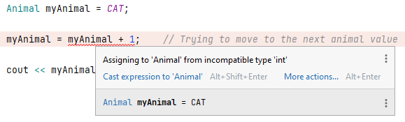

# Types

## Primitives

Primitives are the basic built-in types that are part of the C++ language.

| type   | Size    | min/max                       |
|--------|---------|-------------------------------|
| int    | 4 bytes | -2147483648 to 2147483647     |
| char   | 1 byte  | 0 to 255 (unsigned)           | 
| bool   | 1 byte  | 0 to 1                        |
| float  | 4 bytes | -3.40282e+38 to 3.40282e+38   |
| double | 8 bytes | -1.79769e+308 to 1.79769e+308 |

Note that the size of each type can vary depending on the compiler used.  To 
verify the size, you can use the `sizeof` function.

```c++
cout << "The size of an int is " << sizeof(int) << endl;
```

If you want to find the minimum and maximum of a type, you can use the 
`limits` library.

```c++
#include <iostream>
using namespace std;
#include <limits>

int main() {
    cout << numeric_limits<int>::max() << endl;
    cout << numeric_limits<int>::lowest() << endl;
}
```


# Casting
Casting allow you to manually convert one type to another type.  This is
often required if you are mixing lower and higher precision types.  It is 
also used to convert between different representations

## Casting - integers types and float types

You will often find situations where you will need to cast values when 
mixing integer types and float types since integers have a lower precision.

For example, suppose you were computing the slope of a line in a graphics 
application.  Since you cannot have fractions of a pixel, it makes 
sense that your rise and run will be represented as integer variables.

```c++
// This is bad since we lose precision for the slope
rise = 3;
run = 2;
int slope = rise/run;
cout << "Slope = " << slope << endl;    // This would output 1
```

If we try to declare the variable `slope` as an integer, `slope` would 
store the value `1` rather than the value `1.5`.  Notice that C++ does NOT 
round. Instead, the decimal portion is removed.  This is called 
truncation.  One might try to prevent this truncation by changing the type of 
`slope` from an integer to a float type such as a`double`.  However, this 
does not have the desired effect.

```c++
// This doesn't work
rise = 3;
run = 2;
double slope = rise/run;
cout << "Slope = " << slope << endl;    // This would output 1.0
```

With the above code, you would still find that `slope` still stores the value 
`1`. This has to do with the `rise/run` calculation.  The computer calculates 
`rise/run` *first*, converts the result to a double, and *then* stores this 
converted double into `slope`. The following shows the steps C++ follows to 
complete the slope calculation:
```
rise/run

3/2       substitute the variable values

1         calculate 3/2 as 1

1.0       convert 1 to 1.0 before storing it into slope
```

To avoid truncation for the slope calculation, we need to manually convert the 
types:

```c++
// This does produce the correct result
rise = 3;
run = 2;
double slope = static_cast<double>(rise)/run;
cout << "Slope = " << slope << endl;    // This would output 1.5
```

The `static_cast<double>(rise)` tells the computer to treat rise as a 
`double` instead of an int.  This is called casting.

The above approach works due to a feature called Implicit Conversion. 
Whenever a calculation is done between two operands, the lower precision 
operand is automatically converted the same precision as the higher 
precision operand. Automatically converting the lower precision value to a 
higher precision value is also called ***promotion***.

The following shows the steps C++ follows to complete the slope calculation:
```c++
static_cast<double>(rise)/run

static_cast<double>(3)/2        substitute the variable values

3.0/2                           3 is cast to 3.0 

3.0/2.0                         Since 3.0 is a higher precision, 2 is promoted to 2.0

1.5                             1.5 get stored into slope
```

Note there are multiple ways to use casting and promotion to avoid 
truncation. All four of the following would prevent truncation:

```c++
double slope = static_cast<double>(rise)/static_cast<double>(run);

double slope = static_cast<double>(rise)/run;

double slope = rise/static_cast<double>(run);

double slope = 1.0*rise/run;
```

Note the last example `1.0*rise/run` also works since multiplying `1.0` 
would cause the `rise` variable to be promoted:

```c++
1.0*rise/run

1.0*3/2         substitute the variable values

1.0*3.0/2       Since 1.0 is a higher precision, 3 is promoted to 3.0

3.0/2           1.0*3.0 = 3.0

3.0/2.0         Since 3.0 is a higher precision, 2 is promoted to 2.0

1.5             Final result is 1.5
```

> ### Author's Note
> 
> While multiplying 1.0 works as a way to avoid truncation, some would 
> consider it a bit lazy and "hacky". This shortcut should only be used for 
> non-production code.

## Casting - integers types and char types

Another common place where casting is used is converting between integers 
and characters.

In C++, characters are actually integers where each integer represents a 
specific character.

The original set of integers was ASCII (**A**merican **S**tandard **C**ode 
for **I**nformation **I**nterchange).  ASCII was created to help standardize 
how computers represented characters.

### Printable ASCII
```
  ! " # $ % & ' ( ) * + , - . / 0 1 2 3 4 5 6 7 8 9 : ; < = > ?
@ A B C D E F G H I J K L M N O P Q R S T U V W X Y Z [ \ ] ^ _
` a b c d e f g h i j k l m n o p q r s t u v w x y z { | } ~
```

ASCII only represents 128 different characters.  This limitation created 
issues for other countries that did not use the same language characters.

Since ASCII was too limited, a new standard called Unicode was adopted. 
Unicode has over 140K different characters and includes characters for 
languages used worldwide.  It also defines specific character codes for emojis.

Since `char` and `int` are essentially the same type, it means that you are 
able to use them interchangeably.  However, you will need to perform a cast 
if you want to display an integer as character or vice versa.

```c++
cout << static_cast<char>(65) << endl;          // prints A
cout << 'A' + 1 << endl;                        // prints 66
cout << static_cast<char>('A' + 1) << endl;     // prints B
cout << static_cast<char>('Z' - 1) << endl;     // prints Y
```

## Casting - integers types and bool

The bool type can only store true or false.

```c++
bool boolA = true;
bool boolB = false;
```

In many cases, you will need to be able to convert between `bool` and `int` 
and vice versa.

### Casting bool to int
A value of true will be converted to an integer value of 1.

A value of false will be converted to an integer value of 0.

* true &rarr; 1
* false &rarr; 0

### Casting int to bool

A value of 0 is interpreted as false.

Any value NOT 0 is considered true.

**Examples:**
* 100 &rarr; true
* 42 &rarr; true
* -60 &rarr; true
* -100 &rarr; true
* 0 &rarr; false
## enum

The `enum` allows the easy creation of integer constants.  `enum` is often
used to generate multiple integer constants for conditional "flags" or as 
lookup keys for data structures.

```c++
//    0    1      2
enum {RED, GREEN, BLUE};

//    0    1    2     3
enum {CAT, DOG, FISH, COW};

void main() {
    cout << "RED: " << RED << endl;     // prints 0
    cout << "GREEN: " << GREEN << endl; // prints 1
    cout << "BLUE: " << BLUE << endl;   // prints 2
    cout << endl;
    
    for (int i = CAT; i <= COW; i++) {
        cout << "i = " << i << endl; 
    }
}
```

Each enumeration is essentially an integer constant. The `enum` will automatically assign each
enumeration a value in incremental order.  In the above code, `RED` is given 
the integer value 0, `Green` the integer value 1, and `BLUE` the integer 
value 2.  Similarly, `CAT` is integer value 0, `DOG` the integer value 1, 
`FISH` the integer value 2, and `COW` is the value 3.

Since each enumeration is an integer constant, each enumeration can be 
treated like an integer constant.

It is also possible to create your own constant type using `enum`.  The
following is the same code except defining a type name.

```c++
//          0    1      2
enum Color {RED, GREEN, BLUE};      // Creates a type called Color

//           0    1    2     3
enum Animal {CAT, DOG, FISH, COW};

void main() {
    Color myColor = RED;
    Animal myAnimal = CAT;
    
    cout << "Color: " << myColor << endl;
    cout << "Animal: " << myAnimal << endl;
}
```

The main advantage of this method is that the variable `myColor` will 
automatically be restricted to the values `RED`, `GREEN`, and `BLUE`.  A 
user would NOT be able to set `myColor` to say the value 5.

## Casting - enum types

You will find some instance where you will want to be able to cast `enum` 
types. For example, suppose you want to move to the next animal enumeration.



Notice that the compiler does not recognize Animal as a compatible integer.  
We can solve this issue by using casting.

```c++

//           0    1    2     3
enum Animal {CAT, DOG, FISH, COW};

void main() {
    Animal myAnimal = CAT;      // myAnimal has value 0
    
    myAnimal = static_cast<Animal>(myAnimal + 1);    // Trying to move to the next animal value
    
    cout << myAnimal << endl;   // prints 1
}
```

