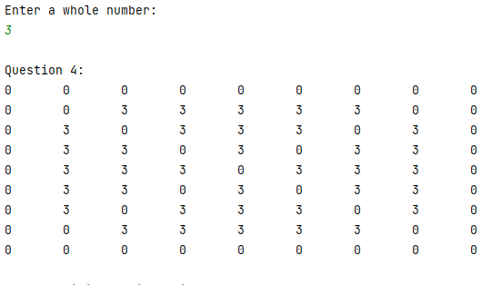

## Single Dimensional Array Sandbox

**_Each function stub can be found in the Array_Practice.cpp file._**

**Array Sandbox Part 1: part1()**

**part1 Instructions:**
Following the examples given in the sample code, write a loop in part1() to modify the array myNumbers.
Write a loop in part1() which will...
1) Set each element's value in myNumbers to double the element number.
   so that element zero is 0, element 1 is 2, element 2 is 4, element i is 2i, etc.
2) Then, output the values of the array to the screen, separated by a space.
   Write your code directly in the part1() file where indicated.

**part1 Sample output:**

**Array Sandbox Part 2: part2()**

**part2() Instructions:**
Following the examples given, write a loop in part2() to modify the array myNumbers.
Write a loop which will...
1) Set the myNumbers[10] array values to 100, 90, 80, 70, 60, 50, 40, 30, 20, 10
   (index 0 is 100, index 9 is 10)
2) output the values of the array to the screen, separated by a newline.
   Write your code directly in part2().

**part2() Sample output:**

**Array Sandbox Part 3: part3()**

**part3() Instructions:**
Following the examples given, write code in part3() to modify the array myNumbers provided.
Write some code and a loop which will...
1) Sum all values in the myNumbers array (The myNumbers array is already provided in the starter code).
2) Output the number of values, sum, average, maximum, and minimum to the screen
   Note the myNumbers array is already declared and initialized for you.  Do not change it.
   Write your code directly in part3().

**part3() Sample output:**

**Array Sandbox Part 4: part4()**

**part4() Instructions:**

Do the following in part4():

1. Declare the char type array tenLetters[MESSAGE_SIZE]
   with MESSAGE_SIZE = 10; (this constant is declared for you)

2. Write a program which prompts the user for ten letters, one at a time,
   pressing Enter between each letter.

3. Use a loop to store the user's input letters in the array tenLetters
   as they are entered by the user.

4. Output the user's input letters back to the user
   both forward and in reverse using a loop and char array,
   with each letter separated by a space.

Write your code directly in part4().

**part4() Sample output:**
using the letters H E L L O W O R L D:

## Multidimensional Array Sandbox

Understanding multidimensional arrays is very important to succeeding in programming!
The purpose of Part 1 is to help you practice working with multidimensional arrays by writing four short
programs.  Follow the instructions provided below to complete part1a, part1b, part1c, and part1d.
You should complete each part directly in the provided() file.
Do not delete or modify any of the existing starter code provided.
You are also encouraged to refer to part1SampleCode().

**Multidimensional Array Sandbox: multi_part_a()**

Complete the multi_part_a() file.

You are provided with some starter code which initializes the myGrid array.
In this part, myGrid is initialized have MAX_ROWS rows and MAX_COLS columns
where MAX_ROWS = 5 and MAX_COLS = 4.  The starter code also includes
code prompting the user for a int value wholeNumber.  Do not modify this
starter code.  Instead, you should add your code directly to the program after
the comments.

Your task is to follow the instructions provided to modify the myGrid array:

1. Assume you have myGrid[MAX_ROWS][MAX_COLS} and wholeNumber as declared above.

2. Modify the myGrid array in this program such that each element is replaced by
   the product of its row and column index and wholeNumber.

For example, if wholeNumber = 3, myGrid[1][2] would be set equal to 6 because
(row)*(col)*(wholeNUmber) = (1)*(2)*(3) = 6.

3. Output all values of myGrid to the screen.
   Each row should be on a new line and each column should be separated by a single tab ("\t")

Make sure your code produces the same output as shown in the sample below.

**multi_part_a() Sample Output**

Your code should produce the same array shown below when
the number 3 is entered.  Notice that the numbers are
separated by "\t" (single tab) and there is a newline
between each row of the array.

**Multidimensional Array Sandbox: multi_part_b()**

Complete multi_part_b().
You are provided with more starter code in multi_part_b().  This time myGrid has 9 rows and 9 columns.
Your task is to complete the following:

1. Modify myGrid such that any row or column which has an even numbered index
   is set equal to zero.  Any element that does not have an even numbered row or column should be
   set equal to wholeNumber.

2. Declare and use a summing variable to determine the sum of all the int values in the array.
   Output the message: "The sum of the values in this array is: " (sum)

3. Output the resulting array to the screen. When outputting to the screen,
   separate each row using a newline and each column by a tab.

Make sure your code produces the same output as shown in the sample below.

**multi_part_b() Sample Output**

Your code should produce the same array and sum shown below when
the number 3 is entered.  Notice that the numbers are
separated by "\t" (single tab) and there is a newline
between each row of the array.  There is no period, space or endline
after the sum is outputted.

**Multidimensional Array Sandbox: multi_part_c()**

Complete multi_part_c().
You are provided with some starter code which initializes the myGrid array.
In this part, myGrid is initialized have MAX_ROWS rows and MAX_COLS columns
where MAX_ROWS = 5 and MAX_COLS = 4.  The starter code also includes
code prompting the user for a int value wholeNumber.  Do not modify this
starter code.  Instead, you should add your code directly to the program after
the comments.

Add for loops and additional code to part1() to complete the following:

1. Use for loops change the values in the array such that all elements are 
   set equal to the index of the element's row times wholeNumber.
   For example, elements in the zeroth row are numbered 0 * wholeNumber, all 
   elements in the second row are numbered 2 * wholeNumber, etc.

2. Output the modified array values to the screen with each row separated by 
   a newline and each column separated by a tab ("\t")

3. Then, declare additional variables to help calculate the sum, average, 
   maximum and minimum value of all values in the array.
   Output the number of values, the sum, the average value, and the maximum and
   minimum values to the screen as shown in the sample code provided.

Be sure that your output matches the samples provided.
Notice there is no additional space after each line of output.
There is no newline after the last line of output.

**multi_part_c() Sample Output**

The below output should be generated when the number 3 is entered:

**Multidimensional Array Sandbox: multi_part_d()**

Complete multi_part_d().
You are provided with some starter code which initializes the myGrid array.

Notice that MAX_ROWS and MAX_COLS are now initialized to 9.
Add code to multi_part_d() to complete the following tasks:

1. We want to create a "X" pattern and border on the perimeter of our array using zeroes.
   Use for loops to change the values in the array such that all elements
   in the perimeter rows and columns are equal to zero. also, all elements
   along the diagonals (where element i = element j) and where element i + j == MAX_ROWS-1
   should be set equal to zero.

2. All elements not on the border or diagonal should be equal to wholeNumber.

3. When done correctly, your code should form a border and "X" shape across the array using zeroes.

4. Output the resulting array to the screen with each row separated
   by a newline and each column separated by a tab.

Make sure your code produces the same output as shown in the sample below.

**multi_part_d() Sample Output**

Your program should produce the following output if the number 3
is used for wholenumber.  Notice that the code produces a border
of zeroes along the outermost rows and columns, and a "X" of
zeros across the array.

