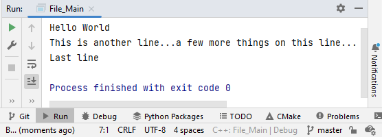
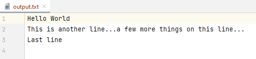

# Reading and Writing Files
Written by Varick Erickson

## `ifstream` and `ofstream`

`ifstream` stands for **_input_ _file_ stream**

`ofstream` stands for **_output_ _file_ stream**

In order to use these objects, you will need to include the `fstream` library.

```c++
#include <fstream>
```

## Writing to a File
`ofstream` objects are used to write to a file.  If you know how to use
`cout`,  then you actually already know how to use `ofstream`.

For example, the following would print several items to the console.
```c++
cout << "Hello World" << endl;
cout << "This is another line...";
cout << "a few more things on this line..." << endl;
cout << "Last line" << endl;
```

> ### Console output
> 

To write the same information to a file, we simply write the data to a
`ofstream` object instead of `cout`.

```c++
ofstream outputFile;
outputFile.open("output.txt");

outputFile << "Hello World" << endl;
outputFile << "This is another line...";
outputFile << "a few more things on this line..." << endl;
outputFile << "Last line" << endl;
outputFile.close();
```

> ### output.txt
> 

> ### WARNING
>
> Use caution when opening a file with `ofstream`.  If the file you are
> opening already exists, `ofstream` will automatically overwrite the entire
> file.
>
> If you want to add data to a file rather than overwrite a file, you will
> need to use the append option when opening the file.
>
> ```c++
> ofstream outputFile;
> outputFile.open("output.txt", ios::app);  // open in append mode
> ```

### Reading files - `ifstream`
`ifstream` objects are used to read files.  If you know how to use `cin`, 
then you actually already know how to use `ifstream`.

```c++
string name;
int age;

// Get values from user
cout << "What is your name? ";
cin >> name;                   // Gets name from user
cout << "How old are you? ";
cin >> age;                    // Gets age from user


ifstream userFile;              // Create a ifstream object
userFile.open("name_age.txt");  // Store contents of name_age.txt into myFile

// Get values from name_age.txt file
userFile >> name;
userFile >> age;

cout << "Name: " << name << endl;
cout << "Age: " << age << endl;

myFile.close();
```

In the example above, `cin >> name;` gets information from the `cin` object 
and stores it into the string variable `name`.

Notice that we have almost exactly the same code when reading the value from 
an input file stream object.  The line `myFile >> name;` gets information from 
the 'myFile' object and stores it into the string variable `name`.

Also notice that `myFile >> age;` is able to automatically convert the data 
from the file into an integer.  The way `myFile` determines the convertion type
is based on the variable type.  Since `age` is an integer, `myFile >> age;` 
will automatically convert the data from `myFile` into an integer before 
storing it into `age`.

The only difference between these two lines is the source of the information:
* `cin` is from the keyboard
* `myFile` is from a file

> **Stream Operator Hint**
>
> How do you know when to use >> versus <<?
>
> The >> and << actually denotes the direction of the information flow.
>
> ```c++
> cout << "Hello world!" << endl;  // "Hello world!" is sent to cout
> 
> cin >> value;   // Data from the keyboard is sent to value
> ```
>
> The same holds true for `ifstream` and `ofstream` objects.

### Checking if the file opened properly

There are several different ways to check if the file opened properly.  Here 
are two common method:

```c++
ifstream badFile;
badFile.open("bad.txt");

if (badFile.fail()) {
    cout << "bad.txt failed to open" << endl;
}
```

```c++
ifstream badFile;
badFile.open("bad.txt");

if (!badFile) {
    cout << "bad.txt failed to open" << endl;
}
```

### Reading all the words in a file

The following code will read through each word in a file.
```c++
ifstream myFile;
myFile.open("file.txt");

string word;
int i = 0;
while (myFile >> word) {
    cout << "Word " << i << ": " << word;
    i++;
}
```

Note that `myFile >> word` will return 0 if nothing can be read from the 
file.  This allows us to use `myFile >> word` as a stop condition for the 
while loop.


### Reading each line of a file

> **NOTE:**
> 
> `getline` is usually only useful if you need a single line from the file 
> and you are planning on using that single line as a string.
> 
> `getline` is less useful if you need to convert the line into a different 
> type or if you need to split line into multiple parts (stringstream can be 
> useful in this case).

The following code will read through each line in a file.
```c++
string line;
int i = 0;
while (getline(myFile, line) {
    cout << "Line " << i << ": " << line;
    i++;
}
```

### Reading values into an array

The following code shows 
```c++
string words[100];

ifstream inputFile;
inputFile.open("array_file.txt");

string word;
int i = 0;
while (inputFile >> word) {
    words[i] = word;
    i++;
}

int numWords = i;
for (int i = 0; i < numWords; i++) {
    cout << words[i] << endl;
}

inputFile.close();
```


