# Linked List

One issue with utilizing arrays is that arrays are fixed in size once 
created.  The only way to "grow" an array is to create a new array and copy 
over all the values from an old array into the new array.  

```c++
int oldArray[100];

.
.
.

int newArray[200];

// Copy all values from the old array into the larger new array
for (int i = 0; i < 100; i++) {
    newArray[i] = oldArray[i];
}


```

An alternate way to store items is to use a linked list data structure. A 
linked list is a method of storing a list of nodes "chained" together using 
memory address.  Each node is a data structure that stores a value and the 
address of the next adjacent node.

```c++
struct Node {
    Node *next;     // Address of adjacent node
    int value;      // Value stored in the node
};
```

The address of the first node is typically called the `head`.  The following 
is a diagram of the data structure.


Notice that the last node of the list has a `next` value of `nullptr`.  This 
indicates that there is no next node.

## Building a Linked List

The following will shows the basic mechanics of how a linked list is built and 
how memory addresses are used to link nodes together.

```c++
// Create a new head
Node *head = new Node;
head->value = 42;
head->next = nullptr;

Node *newNode;
Node *curr = head;

// Add new node to end of list
newNode = new Node;
newNode->value = 5;
newNode->next = nullptr;

// Move to the new end and update
curr->next = newNode;
curr = curr->next;

// Add new node to end of list
newNode = new Node;
newNode->value = 3;
newNode->next = nullptr;

// Move to the new end and update
curr->next = newNode;
curr = curr->next;
```

The following shows a memory diagram for each step of the linked list 
construction.  Note that each time we call `new Node`, a heap memory address 
is returned.  As discussed in the pointer review, these are typically 
hexadecimal values representing memory address in the heap.  To make the code 
easier to follow, we use pretend the computer returns simple sequential 
addresses such as 1000, 2000, etc each time `new Node` is called.

> ### Create the first node
> This code create the first node.  We also set `head` to the address of 
> this first node.
> 
> 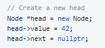 
> 
> 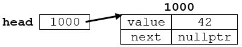

> ### Create some temporary variables
> We create some temporary variables to help us construct the linked list.  
> * `newNode` will contain the memory address of the new node being added.  
>    Note that `newNode` at this point has not been initialized.
> * `curr` will contain the memory address of the current last node of the list.
> 
> 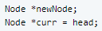 
> 
> 

> ### Create a new Node
> 
> 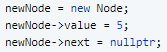 
> 
> 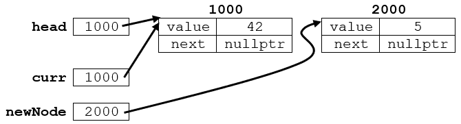

> ### Update `curr` variable
> 
> 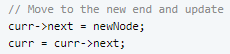 
> 
> 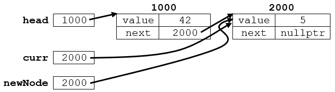

> ### Create a new Node
> 
> We reuse the `newNode` and the updated `curr` variable to add another node 
> to the end.
> 
> 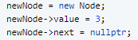 
> 
> 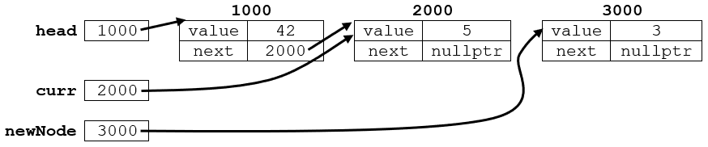

> ### Update `curr` variable
>
> 
> 
> 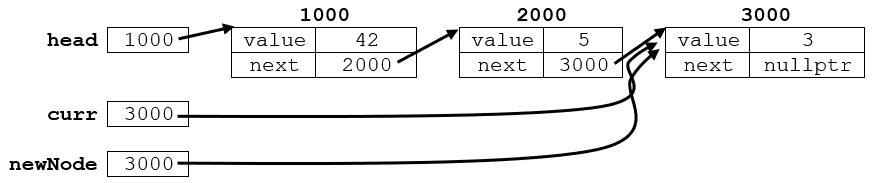

## Traversing a Linked List

Frequently, you will need to be able to traverse through all the values in a 
linked list. Unlike an array, there is no method to immediately access a 
particular node. The only way to get to a particular node is to start at the 
head and then navigate node by node until you reach a particular node.

For example, suppose you wanted to print all the values in a list.

```c++
void PrintList(Node *head) {
    Node *curr = head;         // start search at the head

    while (curr != nullptr) {  // when curr is nullptr, stop the loop
        curr = curr->next;     // move to the next node
    }
}
```

* The above code uses `curr` to store the current location.
* At the beginning, we set `curr` to the `head`.  On each loop, we check to
  see if `curr` is `nullptr`.  If `curr` is `nullptr` this means we have
  reached the end of the linked list.
* We use `curr = curr->next` to move `curr` to the next node.

Another common use case finding a node with a particular value:

```c++
/*
 * Pre-condition:    head is initialized
 * Post-condition:   returns a pointer with the node value
 */
Node* findNode(Node *head, int value) {
    Node *curr = head;         // start search at the head
    
    while (curr != nullptr) {  // when curr is nullptr, stop the loop
        if (curr->value == value) {
            return curr;
        }
        curr = curr->next;     // move to the next node
    }

    return nullptr;     // if we reach here, value does not exist in the list
}
```

* The above code uses `curr` to store the current location.  
* At the beginning, we set `curr` to the `head`.  On each loop, we check to 
  see if `curr` is `nullptr`.  If `curr` is `nullptr` this means we have 
  reached the end of the linked list.  
* If the `curr->value` matches `value`, then the address `curr` is returned.
* We use `curr = curr->next` to move `curr` to the next node. 
* If we loop through the entire list, this means that `value` does not exist.
  In this case, function returns `nullptr`.

## Adding a Node

Suppose we have a linked list as follows:

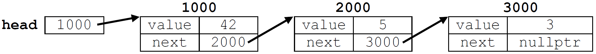

```c++
void AddToFront(Node *&head, int value) {
    Node *node = new Node;
    node->value = value;
    
    node->next = head;
    head = node;
}
```

This code appends a new node to the front of the list.

## Removing a Node

```c++

void RemoveNode(Node& *head, int targetValue) {
    Node *prevNode = nullptr;
    Node *curr = head;
  
    while (curr != nullptr) {
    
        if (curr->value == targetValue) {
            break;      // Found the value.  Break out of the loop.
        }
        
        // Move to the next node
        prevNode = curr;
        curr = curr->next;
    }
    
    // Value was found in the head
    if (curr == head) {
        head = curr->next;  // update the head
        delete curr;
    }
    else if (curr != nullptr) {         // Did not reach end of list
        prevNode->next = curr->next;
        delete curr;
    }
}
```

This code removes the *first* node that contains `targetValue`.

Notice that we require a `prevNode` to store the position of node previous to `curr`.  This is required to relink 
the list.  We assign `prevNode` to be `nullptr` at the beginning of the loop.