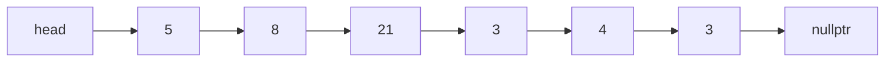
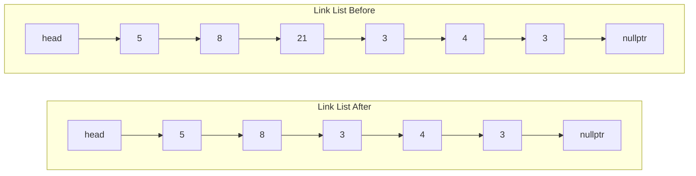
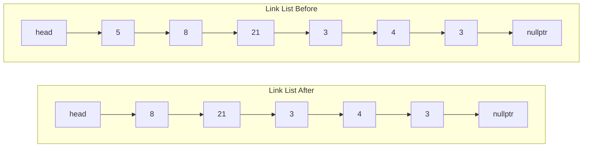
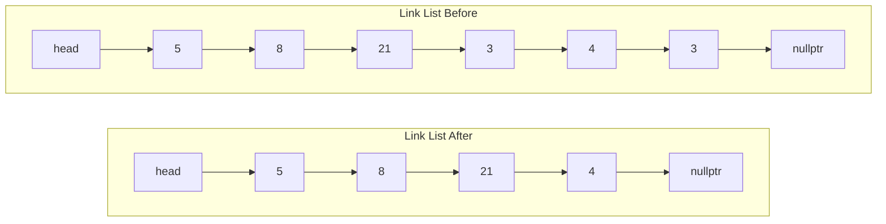

## Exercise 1: Finding a Previous Node

Write a function that finds the node that comes prior to a node with a given  
target value.

```c++
Node* FindPriorNode(Node *head, int value);
```


Suppose we have the following link list:


```c++
Node *prior;

prior = FindPriorNode(head, 21);  // returns node containing 8
cout << prior->value << endl;     // prints 8

prior = FindPriorNode(head, 4);  // returns node containing 3
cout << prior->value << endl;    // prints 3
```

Note that there are some edge cases.
* If the target value does not exist, then the function should return nullptr
* If the target value is in the head, then it should return nullptr
* The function returns the prior node for the *first* instance of the target 
  value.
```c++
Node *prior;

prior = FindPriorNode(head, 42);  // returns nullptr since 42 does not exist

prior = FindPriorNode(head, 5);   // returns nullptr since 5 does not exist

// The list contains two nodes with the value 3.  We only return the prior 
// node to the first instance.
prior = FindPriorNode(head, 3);  // returns node containing 21
cout << prior->value << endl;    // prints 21
```

## Exercise 2: Delete a node using FindPriorNode

Write a `DeleteNode` function that uses your `FindPriorNode` to delete a node.

Suppose we have the following link list:


### General case
The following call to `DeleteNode` would remove 21 from the link list:
```c++
DeleteNode(head, 21);
```
Below shows what the list looks like before and after the above call to 
`DeleteNode`.


### Edge Cases

There are several edge cases you would need to keep in mind.
* If you delete a value that is the head, then the head variable should be 
  updated.
* If you delete a value that is NOT in the list, then the list should remain 
  unchanged
* If you try to delete a value that occurs multiple times in the list, then 
  the function should delete ALL of the instances of the value.

#### Removing the head
The following call to `DeleteNode` would remove 5 from the link list:
```c++
DeleteNode(head, 5);
```
Below shows what the list looks like before and after the above call to
`DeleteNode`.


#### Removing a duplicate
The following call to `DeleteNode` would remove 5 from the link list:
```c++
DeleteNode(head, 3);
```
Below shows what the list looks like before and after the above call to
`DeleteNode`.


## Exercise 3: LinkListInt Class

Complete the `LinkListInt` Class.

### `LinkListInt()` (Constructor)
This function should initialize the `size` and `head`.  The size of the list should initially be 0.  An empty list 
should be represented with a `nullptr` head.

### `~LinkListInt()` (Deconstructor)
This function should remove all the nodes in the list.

### `void Add(int value)`
This function adds a value to the front of the list.  The size of the list should be updated.

> #### HINT
> Look at the AddNode function from the "- Link List.md" file.

### `void Remove(int value)`
This function removes the *first* instance of `value` in the list.  If `value` does not exist, then the list does 
not change.  The size of the list should be updated.

> #### HINT
> Look at the RemoveNode function from the "- Link List.md" file.

### `bool Contains(int value)`
This function returns true if the value exists in the list and false if the value does not exist in the list.

### `int Size()`
This function returns the size of the list.

### `string toString()`
This function traverses over each item in the list and prints the value on new line.

> #### HINT
> Look at the AddNode function from the "- Link List.md" file.